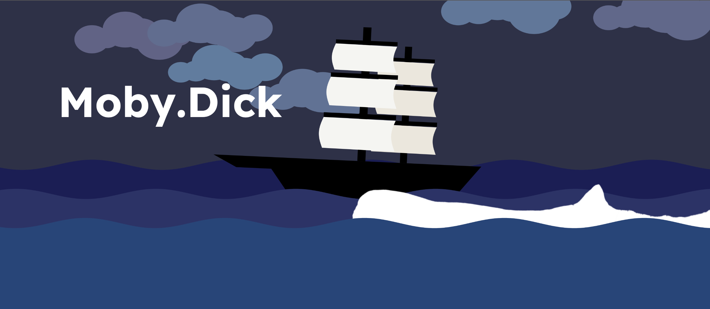
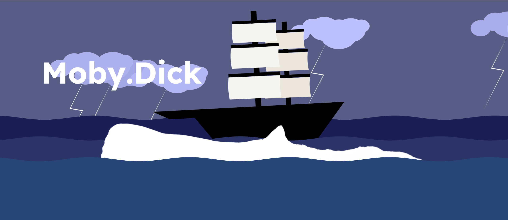
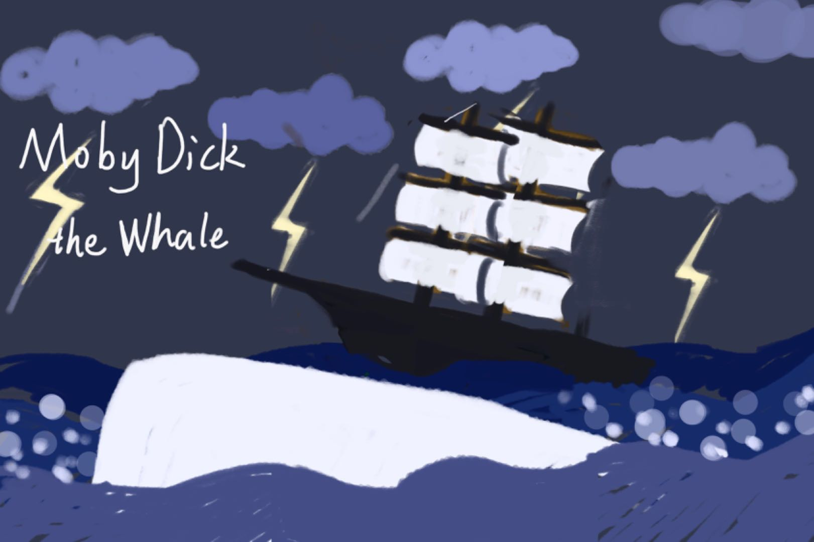

# MileStone 3
#### what you’ve done this week？
For this week, I finish the cover by rejust it position and color. And I add some interactive effect like the whale's position influences the rotation of the ship, and the foam moves accordingly. I also added lightnings occur after mouse clicking and implemented a setTimeout() function that resets the picture to its initial state after it.

#### description of the final interactivity or time-based logic
Clouds: The clouds() function draws clouds based on given x, y positions, size, and number of ellipses per cloud. Each ellipses  has a slightly animated effect using sine functions to simulate movement.
Thunder: The thunder() function draws a white zigzag line over the cloud when the thunder state is true. This state is toggled in mousePressed(), causing thunder to appear briefly across all clouds and change the background color 
Wave: The  waterWave() function creates a sinusoidal wave pattern by mapping vertex positions in a loop, giving the impression of a rolling sea.
Ship: The ship() function creates a ship using a combination of shapes The hull can also move with wind.And using sin() for rotation, the ship gently rocks to simulate the natural motion of floating on water. This rotation will be intensified if the whale is nearby.
Whale: The whale image follows the mouse’s horizontal position, while its vertical position is mapped to the mouse’s y-position with limited range for smoother and reasonable movement. And it rotation using sin(time1 * 10) for a natural swimming effect.
Bubble Effect: The bubble() function generates bubbles near the whale’s position, using an oscillating opacity and random sizing for a realistic look.
Title Text: The text "Moby.Dick" is displayed at a static position, enhancing the thematic connection to the scene.

#### images, drawings, sketches
initial status

after click

# MileStone 2

#### what you’ve done this week
I have write all the fuction I need to use for the final work.And test whether it can work.()
#### description of the files, classes, objects or arrays you will use
I will use the silhouette of the whale and a array called cloudNumbers to store preset random number for clouds' shape and size.
#### description of any interactivity or time-based logic
The cloud, ship, and wave will all move over time. When the mouse is clicked, thunder will occur. The whale will follow the mouse movement, influencing both the wave and the ship.

#### description of functions you have written or will write
Ship Function: The ship can rotate, and its sails billow with the wind. Both its scale and position can also be changed.

Cloud Function: The clouds are created using a series of movable ellipses, with adjustable scale and position.

Water Wave Function: The waves ripple continuously over time. And it position, length, width and waveheight are changable.

Thunder Function: The lightning will appear and disappear over time.

# MileStone 1
#### What book, album or movie did you choose? What is it about?

The book I chose was Moby-Dick; or, The Whale .The story is narrated by Ishmael, a sailor on the whaling ship Pequod, which is led by Captain Ahab. Ahab is obsessed with hunting down the giant white whale, Moby Dick, to take revenge for losing his leg to it during a previous voyage.

This novel also delving into themes such as social class, good and evil, and religion. The story draws inspiration from the real-life sinking of the whaling ship Essex in 1820. Although the theme of this book might seem like it would attract complaints from animal rights organizations, I admire the way it portrays life at sea and reflects on life on land. I also respect Ahab’s relentless pursuit of his goal, even though it borders on madness.

#### What aspect of the book will you include in your cover?

For my cover, I will include these key elements:
Key Elements: The whaling ship and the pursuit of the white whale, Moby Dick.
Atmosphere: A storm is approaching, with turbulent waves and lightning flashing across the sky.
Emotion: Madness and fear intertwine, and the ship is engulfed by an atmosphere of obsession with revenge and tension.
Visual Details: Amid the crashing waves, glimpses of the white whale splashing water can be seen, with the ship rocking up and down on the swells.

#### Is it interactive? Time-based? Both?

The cover will be both interactive and time-based.

Time-based elements: The waves and clouds will move gradually over time, creating a dynamic sea environment.
Interactive elements: When the user clicks the mouse, Moby Dick will appear briefly among the waves, splashing water that makes the ship rock.And lightning will flash in the background, adding tension to the scene.

#### What ideas would you like to explore or experiment with?

I'd like to try more complex interactions by using the mousePressed() or mouseClicked() functions to trigger events when users interact with the scene.And I plan to use if() statements to make Moby Dick’s movement more unpredictable and dynamic. I also consider to incorporating more real data, such as the population size or maximum length of whales over the years, to control the size and movement strength of Moby Dick.

#### Are there aspects of your project that are related to any of the readings we've done?

I think it related to last week's reading which mentioned that books are often seen as the least interactive medium. This inspired me to explore ways to improve their interactivity through my project. By blending technology with storytelling, I aim to make literature more appealing and accessible.

#### Include at least one drawing or sketch

